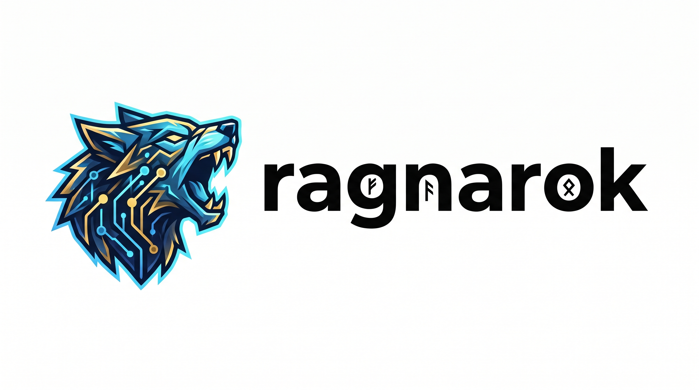

<picture>
  <source media="(prefers-color-scheme: dark)" srcset="assets/logo-negro.jpeg">
  <source media="(prefers-color-scheme: light)" srcset="assets/logo-blanco.jpeg">
  
</picture>

# ragnarok

A personal knowledge base CLI. It stores **knowledge entries** (title, tag, namespace, summary, content, reference) and **docs** (metadata for content whose source of truth lives elsewhere, e.g. a PDF), embeds them locally for hybrid semantic + keyword search, and exposes that store through three interfaces: an interactive terminal UI, a REST API, and an MCP stdio server.

## Features

- **Hybrid search** — semantic (vector) + keyword search over title/tag/summary/content.
- **Local embeddings** — generated in-process via [`@huggingface/transformers`](https://github.com/huggingface/transformers.js) (`Xenova/paraphrase-multilingual-mpnet-base-v2`), no external embedding server required.
- **Two storage backends** — SQLite (default, zero setup) or PostgreSQL with [pgvector](https://github.com/pgvector/pgvector).
- **Docs with chunking** — long content is split into overlapping chunks and embedded individually, so large documents remain searchable; the doc row itself stores only metadata.
- **Three interfaces** — interactive console UI, REST API (with a Scalar API reference), and an MCP server for use as an agent tool.

## Requirements

- Node.js (see `package.json` engines / `@types/node`)
- PostgreSQL with the `pgvector` extension, only if using `DB_ENGINE=postgres`

## Install

```bash
npm install
npm run build
npm link           # installs the `ragnarok` command globally
ragnarok --help
```

## Quick start

By default `ragnarok` connects to PostgreSQL (see [Configuration](#configuration)). Set `DB_ENGINE=sqlite` to use a local SQLite database at `./data/knowledge.sqlite` instead, with no external services required.

```bash
ragnarok ui                # interactive console UI
ragnarok http               # REST API on http://localhost:5555 (API reference at /reference)
ragnarok mcp                 # MCP stdio server
```

Database migrations run automatically on startup for whichever command you invoke.

## Commands

### `ragnarok ui [namespace]`

Starts the interactive terminal UI for creating, updating, and searching knowledge entries and docs. An optional `namespace` argument scopes knowledge entries to that namespace.

### `ragnarok http`

Starts the REST API server.

| Option | Description | Default |
|---|---|---|
| `-p, --port <port>` | Port to listen on | `5555` |

Once running:
- `GET /reference` — interactive API reference (Scalar), backed by `GET /openapi.json`
- `GET/POST /api/knowledge`, `GET/PATCH/DELETE /api/knowledge/:key`, `GET /api/namespaces`, `GET /api/tags`
- `GET/POST /api/docs`, `GET/PATCH/DELETE /api/docs/:key`, `GET /api/doc-tags`, `GET /api/docs/content`

### `ragnarok mcp`

Starts an MCP server over stdio, for use as a tool from an MCP-compatible agent/client. Registers tools: `about`, `search_knowledge`, `list_namespaces`, `list_tags`, `get_knowledge_by_key`, `create_knowledge`, `update_knowledge`, `search_docs`, `search_doc_content`, `list_doc_tags`, `get_doc_by_key`, `create_doc`, `update_doc`. Call `about` first for a full description of the data model and recommended flow.

## Configuration

Configuration is read from environment variables (optionally via a `.env` file at the project root — see `src/env.ts`).

| Variable | Description | Default |
|---|---|---|
| `DB_ENGINE` | `sqlite` or `postgres` | `postgres` |
| `SQLITE_PATH` | Path to the SQLite database file (when `DB_ENGINE=sqlite`) | `./data/knowledge.sqlite` |
| `POSTGRES_HOST` | PostgreSQL host | — |
| `POSTGRES_PORT` | PostgreSQL port | `5432` |
| `POSTGRES_USER` | PostgreSQL user | — |
| `POSTGRES_PASSWORD` | PostgreSQL password | — |
| `POSTGRES_DB` | PostgreSQL database name | `docs` |
| `CHUNK_MAX_CHARS` | Max characters per doc chunk | `2000` |
| `CHUNK_OVERLAP_CHARS` | Overlap between consecutive chunks | `200` |
| `OLLAMA_BASE_URL` / `OLLAMA_EMBEDDING_MODEL` | Reserved for an Ollama-based embedding service | — |

See `docker-compose.yml` for a local `pgvector/pgvector` Postgres instance you can bring up with `docker compose up -d` when using the Postgres backend.

## Scripts

```bash
npm run build          # compile TypeScript to dist/
npm start               # run via ts-node (dev only)
npm run dev              # build then run dist/index.js
npm run migrate:up       # apply Postgres migrations (node-pg-migrate)
npm run migrate:down     # roll back Postgres migrations
npm run migrate:create   # scaffold a new migration
npm run seed              # seed sample data
npm run reembed            # regenerate embeddings for existing entries
npm run eval:search        # run the search evaluation script
```

SQLite migrations (`migrations-sqlite/`) run automatically on startup; Postgres migrations (`migrations/`) are managed via the `migrate*` scripts above.

## Architecture

Domain-driven, ports-and-adapters layout:

- `src/domain/` — entities (`Knowledge`, `Doc`, `DocChunk`) and repository/service interfaces
- `src/application/` — commands and queries (CQRS-style use cases) operating on the domain interfaces
- `src/infrastructure/` — concrete adapters: SQLite/Postgres repositories, the local embedding service, the console UI, and HTTP/OpenAPI wiring
- `src/commands/` — Commander.js command registration (`ui`, `http`, `mcp`)
- `src/container.ts` — composition root; wires the configured DB engine's repositories and the embedding service

See `CLAUDE.md` for more implementation notes (TypeScript module resolution, etc.).
